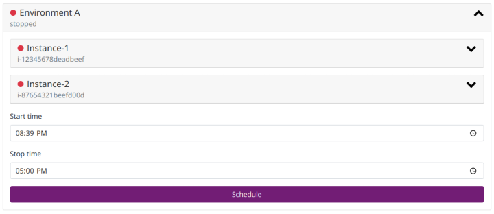



As your AWS estate grows, so will your bill. The flexibility of the cloud makes
it simple to spin up an EC2 instance here or there, but to keep costs in check
it pays off to use the "pay for what you use" model to your advantage.

A production environment will most likely have to run 24/7. But test
environments will sit idle for a lot of the time. Ideally you'd be able to
destroy the entire environment when not in use, and simply provision a new
environment when you need it. This is often not possible, either because your
environment does not support being treated as cattle, or because you just don't
have the capability or capacity to create an environment suitable for this
treatment.

### Simple grouped scheduling

A simple solution; and the first iteration of scheduling we jumped to; is to run
a lambda script in the morning and again in the evening to start and stop all
instances used by test environments. This may not have an impact on storage
cost, but reduces instance cost by nearly 60%.

> As is often the case with small Friday-afternoon projects, this one turned
> out to be quite useful.

We grouped machines depending on when they needed to start and stop, and ran the
lambda's targeted at tags set on the instances. This approach worked well, but
was not very flexible. New groups had to be created every time we needed a
slightly different start and stop time, so some improvement was warranted.
This system was also unable to deal with different days of the week.

### Simple individual scheduling

The next step was to schedule dependent on individual tags on the machines. Each
instance was given a tag with a start- and a stop-time. Another tag was added
with an array of days the scheduled window was valid. The lambda was modified
to deal with these tags, and set to run every minute. The function simply
determined whether the machine was "in window" from the assigned tags. If so it
made sure it was running, and if not it would stop the machine.

We now had the flexibility to schedule instances flexibly, but there were
still two shortcomings to the approach.

### Maintenance windows

Machines often need to be powered on at set times, often during the night, to
carry out important functions. Patches are applied and batches are run. We
needed to account for that.
We introduced the capability to apply maintenance windows; consisting of a
start- and stop-time and an optional days array; to both individual instances
and globally across al instances. An array in the script contains the global
maintenance windows (to be moved to environment variables), and
instance-specific windows can be applied by writing a definition in JSON to
a tag:

```json
[{"days":"1,2","start":"05:00","stop":"08:00"},{"days":"3","start":"02:50","stop":"03:30"}]
```

### Self-serve scheduling

Having been in place for some time, it became clear there were more improvements
to be made. The scheduling at set times was rigid, and did not respond to the
varying use of the environments by testers and developers. Environments would
be scheduled in every working day, but sit idle as efforts were directed
elsewhere.

Ad-hoc scheduling was introduced to put the power back in the hands of the
people. The concept is simple: all instances are turned off by default until
they are actively turned on. This needs to be done manually every time the
environment is needed (although admins can override this if needed). When the
environment is scheduled in by the user it starts at the scheduled time, runs
until the set time, and then shuts down. If it happens to be in a maintenance
window this will take precedence and make sure the machine is powered on.



The interface uses the AWS API to set a start, stop and self-serve tag on the
machine that the scheduling lambda picks up on. With the self-serve tag missing
the script treats the instance as a non-self-serve scheduled instance.

After some evolution the scheduling system, whilst simple, has become a very
effective tool in improving cost-efficiency of our part-time instances. It is
easy to use, yet flexible enough to do what we need it to do. I'm sure the
system will evolve further as requirements come to light, but it is quite
effective in its current incarnation.

This was one of those projects that wasn't designed to an extensive set of
requirements from the get-go. It was slowly built up over time in those hours
on the Friday afternoon that just don't lend themselves to starting on a bigger
piece of work. Those hours invested experimenting with the little things you've
been meaning to tackle but never have the time to. As is often the case with
small Friday-afternoon projects, this one turned out to be quite useful.

### Run it yourself

Whilst I can't share the user-interface allowing the scheduling, we've made the
smartEc2Schedule Lambda open-source under the MIT license.

You can find it [on my gitlab page](https://gitlab.com/dcolon/smartec2schedule).

Or alternatively download a packaged version ready to deploy
[here.](smartEc2Schedule_rev_48fa88a.zip)