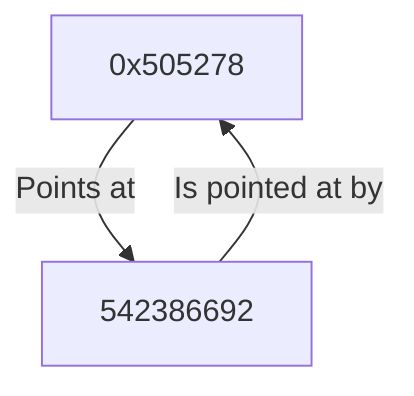



Pointers are a concept that, when first encountered, may be hard to wrap your
head around. As is the case with many concepts in programming, it is useful
to understand the underlying mechanisms. Looking under the hood is not only a
useful way to learn how to use something, it'll also help to reason about
behaviour that may not be immediately obvious.

This article will explore what pointers are, how to use them, and what is going
on beneath the surface. If this is your first time encountering things like
`&variable`, `parameter *type`, or even `parameter **type` this article will
help you make sense of that.

## Memory

To understand pointers, we first need to make a detour into how memory works.
When your computer starts a program, it is loaded from disk and into memory.
Whenever you do something like initialise a variable, this will allocate some
space in the computer's memory to hold the information. Depending on the size
of this variable, more size is needed. For example: an 8 bit integer takes up
(you guessed it) 8 bits of memory (or 1 byte). What this means is that inside
the computer memory, there are 8 memory cells set to a 1 or 0 depending on the
value of the integer. Something like: `0011 1100` which is the integer number
60.

As multiple programs run together on the machine, the computer needs to have
some way of tracking which pieces of memory represent what. To be able to do
that, each piece of memory has its own address:

| Address | Value         |
| ------- | ------------- |
| 0x0001  | **0011 1100** |
| 0x0002  |   0000 0000   |
| 0x0003  |   0000 0000   |
| ...     |   ...         |
| 0xFFFF  |   0000 0000   |

In this example, we can see that our 8 bit integer is stored in the block of
memory with address `0x0001` (note the `0x` at the start indicates the address
is formatted in [hexadecimal](https://en.wikipedia.org/wiki/Hexadecimal)).

So what happens when we have a piece of data that is too large to fit into those
8 bits of computer memory like a 32 bit integer
`0010 0000 0101 0100 0010 1010 0000 0100` representing the number 542386692?
It is simply put into multiple memory cells. The computer remembers the address
of the first of these cells, and knows from the type (in this case, a
**32** bit integer) how many cells it needs to read to get all the data. Let's
see what it looks like when we assign our 32 bit integer to a piece of memory
following our 8 bit integer:

| Address | Value         |
| ------- | ------------- |
| 0x0001  |   0011 1100   |
| 0x0002  | **0010 0000** |
| 0x0003  | **0101 0100** |
| 0x0004  | **0010 1010** |
| 0x0005  | **0000 0100** |
| ...     |   ...         |
| 0xFFFF  |   0000 0000   |

As we can see, the addresses `0x0002` up `0x0005` are now used to store our
32 bit integer number, using up 4 of the 8 bit memory cells.

## Pointers

So, back to pointers. We've really done the legwork by now. A pointer is just a
memory address. We use the `&` or `reference` operator (we can read this as
"address of") to get the memory address of whatever variable we put it in front
of. The `*`, `de-reference` (we can read this as "value pointed at by") to get
the content of the memory an address (or pointer) points at.

Let's have a look at an example in C++:
```cpp
#include <iostream>

int main() {
    // First assign the number from our example to a 32 bit unsigned integer:
    uint32_t number = 542386692;
    // Then print it's address using the reference operator &:
    std::cout << &number << std::endl;

    return 0;
}
```
[Have a play with it here!](https://cpp.sh/?source=%2F%2F+Example+program%0A%23include+%3Ciostream%3E%0A%23include+%3Cstring%3E%0A%0Aint+main()%0A%7B%0A++std%3A%3Astring+name%3B%0A++std%3A%3Acout+%3C%3C+%22What+is+your+name%3F+%22%3B%0A++getline+(std%3A%3Acin%2C+name)%3B%0A++std%3A%3Acout+%3C%3C+%22Hello%2C+%22+%3C%3C+name+%3C%3C+%22!%5Cn%22%3B%0A%7D)

This piece of code prints out: `0x505278`, which is the memory address the value
of our number is stored. Now try and see what happens if you change that output
line:

```cpp
std::cout << *&number << std::endl;
```

As you may have guessed, it just prints out the value of our number `542386692`.
What we're doing is using the `&` operator to get the memory address of the
number, and then immediately getting the value at that address with `*`.
In plain language, `*&number` reads as "the value pointed at by the address of
number".



## Pointer types

We've now seen we can get a pointer to a piece of memory with the `&` operator,
and how we can then get the actual value that pointer points at by
de-referencing it with `*`. The last piece in the puzzle is understanding
pointer types. One of the reasons we use pointers is so that we can pass them
around in our program. That means that if we have a big piece of data stored
somewhere in our memory, we can simply pass a pointer to that data around,
rather than all the data itself. This is much faster as it means we only have
to copy a small pointer.

To represent a pointer as a variable we use a pointer type rather than just the
address. For example, a pointer to a 32 bit unsigned integer is declared as
`uint32_t* <variable name>`. 

> There is [some discussion](https://wiki.c2.com/?HolyWar) about whether to
> write it as I did, or as `uint32_t *<variable name>`, or even as
> `uint32_t * <variable name>`. As far as I'm concerned, it is part of the type,
> and sits next to the type definition. You may see any of these styles, and it
> really comes down to personal preference or any style guides. The main things
> is to be consistent.

The reason we can't just pass the memory address around as a number
is that the computer needs to know what type the pointer is pointing to. As
we've seen in our explanation of memory, the type will tell the computer how
many sections of memory it needs to read. If the type is wrong, the computer
may try to read memory that stores different variables, something to be very
weary of. We'll discuss this a bit more at the end of this article.

Let's have a look at pointer types by modifying the little program we
looked at earlier:

```cpp
#include <iostream>

void test(uint32_t* address_of_number) {
    std::cout << address_of_number << std::endl;
    std::cout << *address_of_number << std::endl;
}

int main() {
    // First assign the number from our example to a 32 bit unsigned integer:
    uint32_t number = 542386692;
    // Get the address of number and store it.
    uint32_t* address_of_number = &number;
    // Then print the address:
    std::cout << address_of_number << std::endl;
    // Then get the value by de-referencing our pointer type:
    std::cout << *address_of_number << std::endl;
    // Or pass it into a function:
    test(address_of_number);
    return 0;
}
```
[Have a play with it here!](https://cpp.sh/?source=%2F%2F+Example+program%0A%23include+%3Ciostream%3E%0A%23include+%3Cstring%3E%0A%0Aint+main()%0A%7B%0A++std%3A%3Astring+name%3B%0A++std%3A%3Acout+%3C%3C+%22What+is+your+name%3F+%22%3B%0A++getline+(std%3A%3Acin%2C+name)%3B%0A++std%3A%3Acout+%3C%3C+%22Hello%2C+%22+%3C%3C+name+%3C%3C+%22!%5Cn%22%3B%0A%7D)

Which prints:
```
0x505278
542386692
0x505278
542386692
```

As you can see, we can use a pointer type to store a pointer in a variable, and
then pass it around like any other variable. We can even define a function
that takes a pointer type as an argument.

## Modifying the value pointed at

Let's now modify our code a little bit more, and see what happens when we write
some data to the referenced memory using the pointer:

```cpp
#include <iostream>

// A function that takes a pointer.
void test(uint32_t* address_of_number) {
    // We can't change the pointer, but we can change what it points to.
    *address_of_number = 42;
}

int main() {
    // First assign the number from our example to a 32 bit unsigned integer:
    uint32_t number = 542386692;
    // Get the address of number and store it.
    uint32_t* address_of_number = &number;
    // Then get the value by de-referencing our pointer type:
    std::cout << *address_of_number << std::endl;
    // Pass it into the function.
    test(address_of_number);
    // The print it again:
    std::cout << *address_of_number << std::endl;
    return 0;
}
```
[Have a play with it here!](https://cpp.sh/?source=%2F%2F+Example+program%0A%23include+%3Ciostream%3E%0A%23include+%3Cstring%3E%0A%0Aint+main()%0A%7B%0A++std%3A%3Astring+name%3B%0A++std%3A%3Acout+%3C%3C+%22What+is+your+name%3F+%22%3B%0A++getline+(std%3A%3Acin%2C+name)%3B%0A++std%3A%3Acout+%3C%3C+%22Hello%2C+%22+%3C%3C+name+%3C%3C+%22!%5Cn%22%3B%0A%7D)

This time the program prints out:

```
542386692
42
```

We modified the value referenced by the pointer inside the function rather than
returning it from the function. Whilst this may be the right approach when
you want to avoid passing around large chunks of memory, it is better to avoid
doing this, as this causes a
[side effect](https://en.wikipedia.org/wiki/Side_effect_(computer_science))
which will make your program harder to reason about, and harder to test.

## Pointers to pointers

One other thing we can do is create a pointer to a pointer:
```cpp
#include <iostream>

int main() {
    // Let's assign two numbers
    uint32_t number_a = 542386692;
    uint32_t number_b = 123456;
    // Get the addresses.
    uint32_t* address_of_number_a = &number_a;
    uint32_t* address_of_number_b = &number_b;
    // Then assign it to another variable.
    uint32_t** address_of_address_of_number = &address_of_number_a;
    // Print it out.
    std::cout << "&address_of_address_of_number:  " << &address_of_address_of_number << std::endl;
    std::cout << "address_of_address_of_number:   " << address_of_address_of_number << std::endl;
    std::cout << "*address_of_address_of_number:  " << *address_of_address_of_number << std::endl;
    std::cout << "**address_of_address_of_number: " << **address_of_address_of_number << std::endl;
    // Re-assign and print out again
    address_of_address_of_number = &address_of_number_b;
    std::cout << "&address_of_address_of_number:  " << &address_of_address_of_number << std::endl;
    std::cout << "address_of_address_of_number:   " << address_of_address_of_number << std::endl;
    std::cout << "*address_of_address_of_number:  " << *address_of_address_of_number << std::endl;
    std::cout << "**address_of_address_of_number: " << **address_of_address_of_number << std::endl;
    return 0;
}
```
[Have a play with it here!](https://cpp.sh/?source=%2F%2F+Example+program%0A%23include+%3Ciostream%3E%0A%23include+%3Cstring%3E%0A%0Aint+main()%0A%7B%0A++std%3A%3Astring+name%3B%0A++std%3A%3Acout+%3C%3C+%22What+is+your+name%3F+%22%3B%0A++getline+(std%3A%3Acin%2C+name)%3B%0A++std%3A%3Acout+%3C%3C+%22Hello%2C+%22+%3C%3C+name+%3C%3C+%22!%5Cn%22%3B%0A%7D)

Which prints out:
```
&address_of_address_of_number:  0x5052f8
address_of_address_of_number:   0x505300
*address_of_address_of_number:  0x505308
**address_of_address_of_number: 542386692

&address_of_address_of_number:  0x5052f8
address_of_address_of_number:   0x5052fc
*address_of_address_of_number:  0x505304
**address_of_address_of_number: 123456
```

As you can see, we can create a pointer to a pointer, and do the same things we
can do with a normal pointer. This is useful when we want to change the address
a pointer points to inside a function. You'll rarely need this, so if you do
encounter it have a good think on whether there is a better way to achieve what
you've set out to do.

## Safety

Now I'd be remiss if I didn't touch on safety in an article about pointers.
Whilst we didn't go into
[pointer arithmetic](https://cplusplus.com/doc/tutorial/pointers/#arithmetics),
or looking at arrays and how they use pointers, we will have a brief look at
pointer (or memory) safety. This is a big topic, and I'd encourage any developer
to [explore if further](https://en.wikipedia.org/wiki/Memory_safety). As memory
errors like buffer overflows or buffer over-reads are historically responsible
for the bulk of vulnerabilities found in software.

Let's say we go back to our memory map from earlier section, but this time
we are storing some text data as well:

| Address | Value     |
| ------- | ----------|
| 0x0001  | 0011 1100 |
| 0x0002  | 's'       |
| 0x0003  | 'e'       |
| 0x0004  | 'c'       |
| 0x0005  | 'r'       |
| 0x0006  | 'e'       |
| 0x0007  | 't'       |
| ...     |   ...     |
| 0xFFFF  | 0000 0000 |

In address `0x0001` I have stored some 8 bit integer. And there is some other
user's secret password that happens ot be stored in the bit of memory next to
it. Let's simulate what could happen:
```cpp
#include <iostream>

int main() {
    // Let's define some variables.
    uint8_t number = 0b00111100;
    std::cout << (int) number << std::endl;
    uint8_t sometext[6] = {'s','e','c','r','e','t'};
    // And then simulate a bit of 8 bytes of memory containing both:
    uint8_t memory[8] = {
        number,
        sometext[0],
        sometext[1],
        sometext[2],
        sometext[3],
        sometext[4],
        sometext[5],
        0
    };
    // And then create a pointer pointing at our number in that block of memory:
    uint8_t* numberPointer = &memory[0];
    // All good!
    std::cout << (int) *numberPointer << std::endl;
    // We did some stuff with pointers, and accidentally re-assigned out 8bit int pointer to 64 bits.
    uint64_t* newPointer = (uint64_t*)numberPointer;
    // And then print it to our user:
    std::cout << *newPointer << std::endl;
}
```
[Have a play with it here!](https://cpp.sh/?source=%2F%2F+Example+program%0A%23include+%3Ciostream%3E%0A%23include+%3Cstring%3E%0A%0Aint+main()%0A%7B%0A++std%3A%3Astring+name%3B%0A++std%3A%3Acout+%3C%3C+%22What+is+your+name%3F+%22%3B%0A++getline+(std%3A%3Acin%2C+name)%3B%0A++std%3A%3Acout+%3C%3C+%22Hello%2C+%22+%3C%3C+name+%3C%3C+%22!%5Cn%22%3B%0A%7D)

Which outputs:
```
60
60
32762639266706236
```

Oops, what is this big number we accidentally printed to the user? If we use an
online converter from integer to characters we get this:

```
terces<
```

Where the `<` is the character representation of out 8bit integer. And the other
character is the `0`. In the middle we find the password of the other user that
we just leaked by accidentally accessing the wrong bit of memory.

This example seems a bit far-fetched, but there have been many cases where bugs
very similar to this have caused serious issues, such as the
[heartbleed bug](https://en.wikipedia.org/wiki/Heartbleed). The takeaway: be
careful manually manipulating memory, or even better: avoid it altogether.

## Conclusion

I hope this article helped you wrap your head around how pointers work and how
they can be used. We only looked at things from a very high level, and glossed
over lots of detail. If you want to dive a bit deeper, I'd recommend you google
some of the following terms:
- Virtual memory
- Stack and heap
- Pointer arithmetic
- Strings in C
- Pass by reference vs pass by value vs pass by pointer

And dive a bit deeper into something that is very relevant to anyone writing
software. Even if you work in high-level programming languages like Python, it
will still use these mechanisms under the hood - and it is good to understand
them.
